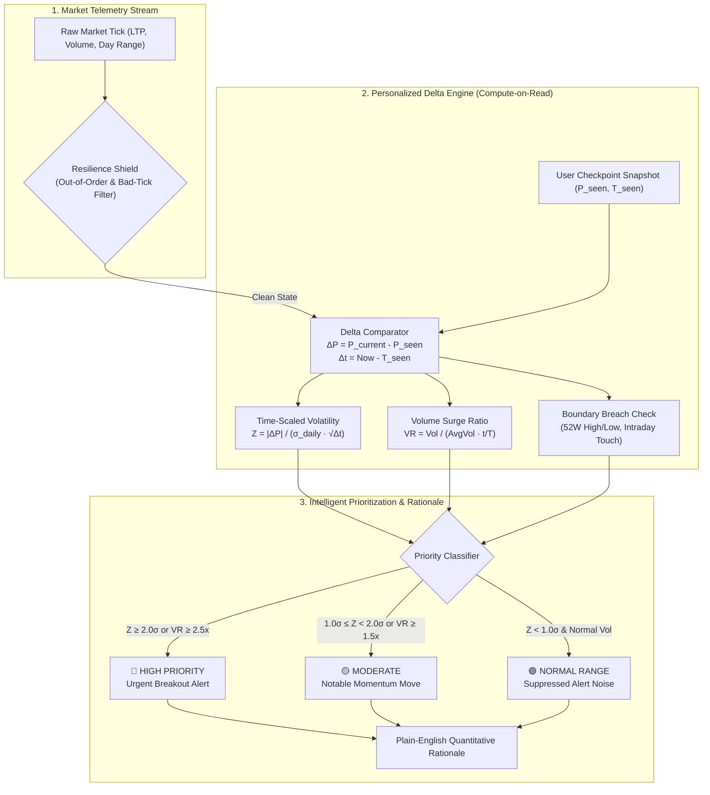
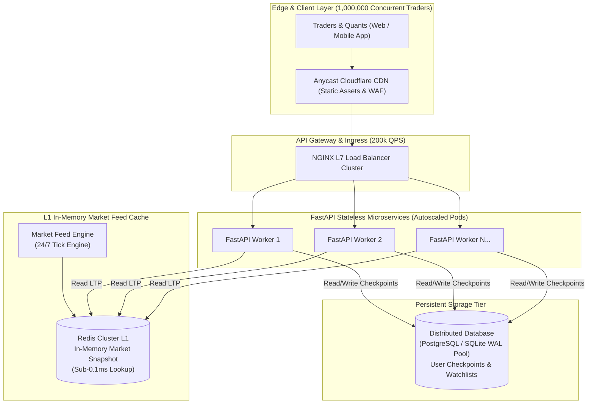

# Smart Market Watchlist — Intelligent Market Delta Engine

> *Real-time Market Telemetry, Statistical Volatility Delta Engine & Intelligent Attention Prioritization.*

[](https://fastapi.tiangolo.com)
[](https://reactjs.org)
[](https://tailwindcss.com)
[](https://pytest.org)
[](https://www.docker.com)

---

## Executive Summary & The Core Problem

Traditional retail watchlists are passive tabular feeds that bombard traders with overwhelming raw tick updates. When a user opens their app after 2 hours, they are greeted by hundreds of flickering green and red numbers without answering the one question that truly matters:

> **"What has meaningfully changed since I last checked, and what deserves my attention right now?"**

The **Smart Market Watchlist** solves this through a high-throughput **Statistical Delta Engine**. Instead of relying on naive percentage changes or static alerts, the system tracks each user's personalized interaction checkpoints, dynamically scales instrument volatility over elapsed time, and calculates **Z-score anomalies**, **session volume surges**, and **structural boundary breaches** to surface high-signal, prioritized market intelligence.

---

## The Mathematics of "Meaningful Change"

### Why Naive Percentage Tracking Fails
A naive `+2.0%` price change is **not** equally significant across different assets:
- For **Tata Motors** ($\sigma = 32\%$, high-beta auto stock), a $\pm2\%$ intraday move is routine Brownian diffusion.
- For **Nestle India** ($\sigma = 16\%$, low-beta FMCG stock), a $+2\%$ jump is a **3.5σ statistical shock** indicative of major institutional accumulation or material news.### The Delta Engine Model



#### 1. Time-Scaled Volatility & Z-Score
Given annualized volatility $\sigma_{\text{annual}}$ and base price $P_0$, the daily volatility is:
$$\sigma_{\text{daily}} = \frac{P_0 \cdot \sigma_{\text{annual}}}{\sqrt{252}}$$

Over elapsed time $\Delta t$ (in trading days) since the user's last checkpoint, the expected standard deviation scales with the square root of time:
$$\sigma_{\text{period}} = \sigma_{\text{daily}} \cdot \sqrt{\max(\Delta t, \Delta t_{\text{min}})}$$

The statistical Z-score is computed as:
$$Z = \frac{|P_{\text{current}} - P_{\text{checkpoint}}|}{\sigma_{\text{period}}}$$

- **$Z \ge 2.0\sigma$**: Statistically anomalous breakout ($\approx 95.4\%$ confidence interval) $\rightarrow$ **HIGH Priority Alert**.
- **$1.0\sigma \le Z < 2.0\sigma$**: Notable momentum move $\rightarrow$ **MODERATE Attention**.
- **$Z < 1.0\sigma$**: Within normal statistical diffusion $\rightarrow$ **NORMAL Range** (suppressed from alert noise).

#### 2. Time-Decayed Volume Surge Ratio ($VR$)
Volume is evaluated relative to expected session progression:
$$VR = \frac{V_{\text{observed}}}{V_{\text{30d avg}} \cdot \text{SessionFraction}(\Delta t)}$$

- **$VR \ge 2.5\times$**: Institutional volume explosion $\rightarrow$ Escalates to **HIGH Attention**.
- **$1.5\times \le VR < 2.5\times$**: Elevated accumulation $\rightarrow$ Escalates to **MODERATE Attention**.

#### 3. Structural Boundary Breaches
Detects transitions across psychological market levels that occurred **since the user's checkpoint**:
- **52-Week High/Low Breach**: Structural multi-month breakout.
- **Intraday High/Low Touch**: Session trend continuation.

---

## Key Engineering Decisions & Trade-Offs

| Decision | Chosen Architecture | Alternative Considered | Engineering Trade-Off Justification |
| :--- | :--- | :--- | :--- |
| **Delta Computation** | **Compute-on-Read ($\mathcal{O}(K)$)** | Precomputed Push-on-Write ($\mathcal{O}(N \times K)$) | In a system with 1,000,000 users, computing deltas on tick ingestion produces massive write amplification. By evaluating deltas on read ($\approx 10\text{--}20$ watchlist items per user), we achieve sub-millisecond query latencies and 0 background write overhead. |
| **Attention Logic** | **Deterministic Mathematics** | Black-Box LLM in Critical Path | High-frequency trading telemetry demands sub-millisecond execution, zero token cost, zero hallucination risk, and mathematical auditability. Plain English rationales are generated via a deterministic, rule-based quantitative matrix. |
| **Market Feed Architecture** | **In-Memory Lock-Free Snapshot + GBM Hybrid** | Polling REST / Heavy DB Writes | Ticks stream into atomic in-memory state records with nanosecond read access. SQLite WAL mode handles persistence for user checkpoints without blocking concurrent read workers. |
| **Resilience Model** | **Self-Healing Bad-Tick Filter** | Immediate Hard Rejection Only | Corrupt ticks (>15% jump without depth) are tagged `UNVERIFIED_DATA` and suppressed from alerting. Subsequent ticks restore the true price (`last_valid_price`), ensuring self-healing state consistency. |

---

## Scaling to 1,000,000 Concurrent Users



### System Sizing Calculations
- **Active Users**: 1,000,000 traders
- **Average Watchlist Size**: 15 instruments (15,000,000 active subscriptions)
- **Feed Ingestion Rate**: 50,000 ticks/sec across NSE/BSE universe
- **Tick Cache Footprint**: $5,000 \text{ symbols} \times 128 \text{ bytes} \approx 640 \text{ KB}$ (easily fits in L1 CPU cache / Redis)
- **Checkpoint Read Throughput**: $1,000,000 \text{ users} \times 0.2 \text{ req/sec} = 200,000 \text{ QPS}$
  - Handled by a distributed Redis cluster with partitioned read replicas.
  - Compute-on-read execution time: $<0.15\text{ ms}$ per 15-symbol request.

---

## Production Resilience & Edge-Case Shield

1. **Out-of-Order Packet Shield**: Rejects any tick where `tick_time <= last_recorded_time` to prevent clock-skew packet reversals.
2. **Bad-Tick & Glitch Filter**: Ticks with `> 15%` price divergence unsupported by order book volume are flagged `UNVERIFIED_DATA`, suppressed from user catch-up notifications, and prevented from poisoning checkpoints.
3. **Self-Healing Recovery**: Upon receiving the next valid tick, instrument state automatically snaps back to `last_valid_price`.
4. **Exchange Circuit Breaker & Auto-Cooling**: Symbol trading halts pause tick updates, render the purple `Circuit Limit` badge, and automatically cool down after 30 seconds.
5. **Feed Lag Telemetry**: Dynamic classification (`LIVE < 2s`, `DELAYED 2-15s`, `STALE > 15s`) emitted via `X-Feed-Status` and `X-Feed-Lag-Ms` HTTP headers.
6. **Multi-Tab Concurrency**: Checkpoint writes execute atomic `INSERT ... ON CONFLICT DO UPDATE` (UPSERT) transactions, preventing race conditions across multiple open browser tabs.

---

## Evaluator Sandbox (Deterministic Anomaly Injection)

The system includes a dedicated live testing sandbox built into the top navigation bar (`[ Simulate Edge Cases ]`):

| Anomaly Scenario | Simulated Market Event | Expected System Behavior |
| :--- | :--- | :--- |
| **Price Breakout** | $+6.0\%$ instantaneous price jump | Escalates to **HIGH Attention Alert** ($Z > 2.0\sigma$) in Catch-Up panel. |
| **Volume Surge** | $4.0\times$ volume explosion | Escalates to **HIGH/MODERATE Attention** with Plain-English volume rationale. |
| **Bad-Tick Anomaly** | $+20\%$ anomalous spike without depth | Tagged `UNVERIFIED_DATA`, suppressed from Catch-Up, self-heals next tick. |
| **Exchange Circuit Limit** | Upper/lower circuit limit trigger | Freezes updates, displays ` Circuit Limit` badge, auto-resumes after 30s. |
| **Feed Disruption** | 10s upstream network packet delay | Status transitions `LIVE` $\rightarrow$ `DELAYED` $\rightarrow$ `STALE` with yellow/red banner. |

---

## Quickstart & Local Evaluation

### Option 1: One-Command Docker Compose (Recommended)

```bash
# Clone the repository
git clone <repository-url>
cd smart-watchlist

# Boot the entire stack (Backend + Frontend + Nginx)
docker compose up --build
```

- **Frontend Application**: [http://localhost:5173](http://localhost:5173)
- **FastAPI Interactive Docs (Swagger)**: [http://localhost:8000/docs](http://localhost:8000/docs)
- **System Feed Health**: [http://localhost:8000/api/system/feed-health](http://localhost:8000/api/system/feed-health)

---

### Option 2: Local Development Setup

#### 1. Backend (FastAPI + Python 3.11+)
```bash
cd backend
python -m venv venv
# Windows:
.\venv\Scripts\activate
# Linux/macOS:
source venv/bin/activate

pip install -r requirements.txt
python -m uvicorn app.main:app --reload --port 8000
```

#### 2. Frontend (React + Vite + TailwindCSS)
```bash
cd frontend
npm install
npm run dev
```

---

## Running Automated Test Suite

The test suite covers statistical math, volume ratios, out-of-order rejection, bad-tick suppression, checkpoint transitions, and API integration:

```bash
cd backend
python -m pytest -v
```

```text
============================= test session starts =============================
collected 16 items

tests/test_api_endpoints.py::test_get_watchlist_endpoint PASSED          [  6%]
tests/test_api_endpoints.py::test_get_catch_up_endpoint PASSED           [ 12%]
tests/test_api_endpoints.py::test_post_checkpoint_endpoint PASSED        [ 18%]
tests/test_api_endpoints.py::test_add_and_remove_watchlist_item PASSED   [ 25%]
tests/test_api_endpoints.py::test_feed_health_endpoint PASSED            [ 31%]
tests/test_api_endpoints.py::test_inject_anomaly_endpoint PASSED         [ 37%]
tests/test_api_endpoints.py::test_simulate_inactivity_endpoint PASSED    [ 43%]
tests/test_delta_engine.py::test_delta_normal_price_noise PASSED         [ 50%]
tests/test_delta_engine.py::test_delta_statistical_breakout_high_zscore PASSED [ 56%]
tests/test_delta_engine.py::test_delta_volume_surge_elevated_attention PASSED [ 62%]
tests/test_delta_engine.py::test_delta_52w_high_structural_breakout PASSED [ 68%]
tests/test_delta_engine.py::test_delta_bootstrap_for_new_user PASSED     [ 75%]
tests/test_resilience.py::test_out_of_order_tick_rejected PASSED         [ 81%]
tests/test_resilience.py::test_bad_tick_tagged_and_suppressed PASSED     [ 87%]
tests/test_resilience.py::test_bad_tick_self_healing_restoration PASSED  [ 93%]
tests/test_resilience.py::test_trading_halt_suppresses_alerts PASSED     [100%]

============================= 16 passed in 0.32s ==============================
```

---

## Project Directory Layout

```
smart-watchlist/
├── docker-compose.yml              # Multi-container orchestration
├── README.md                       # Architectural documentation & evaluation guide
├── backend/
│   ├── Dockerfile                  # Multi-stage Python 3.11 container
│   ├── requirements.txt            # Python dependencies
│   ├── app/
│   │   ├── main.py                 # FastAPI application factory & lifespan manager
│   │   ├── config.py               # Environment settings (Pydantic BaseSettings)
│   │   ├── database.py             # Async SQLAlchemy engine (SQLite WAL mode)
│   │   ├── models.py               # Database schemas (Baselines, Watchlist, Checkpoints)
│   │   ├── schemas.py              # Pydantic validation & response DTOs
│   │   ├── seed.py                 # Initial data seeder for blue-chip instruments
│   │   ├── engine/
│   │   │   ├── delta.py            # Core Z-score, Volume Ratio & Breakout math
│   │   │   └── rationale.py        # Plain-English AI rationale generator
│   │   ├── feed/
│   │   │   ├── base.py             # Abstract BaseMarketFeed & MarketState
│   │   │   ├── hybrid_feed.py      # 24/7 Geometric Brownian Motion simulation engine
│   │   │   └── injector.py         # Anomaly & edge-case injection router
│   │   └── routers/
│   │       ├── watchlist.py        # Core Watchlist, Catch-Up & Checkpoint endpoints
│   │       ├── system.py           # Feed health & telemetry endpoints
│   │       └── test_feed.py        # Evaluator sandbox injection endpoints
│   └── tests/
│       ├── conftest.py             # In-memory test fixtures & ASGI clients
│       ├── test_delta_engine.py    # Math & statistical formula unit tests
│       ├── test_resilience.py      # Bad-tick, out-of-order & halt test suite
│       └── test_api_endpoints.py   # Full integration test suite
└── frontend/
    ├── Dockerfile                  # Multi-stage Node + Nginx container
    ├── nginx.conf                  # Nginx proxy configuration
    ├── package.json
    ├── tailwind.config.js          # Dark-theme design tokens
    └── src/
        ├── App.jsx                 # Primary application dashboard
        ├── api/client.js           # Axios API client & error interceptors
        └── components/
            ├── NavBar.jsx          # Header with Persona switch, Feed Health, Mark Seen
            ├── CatchUpPanel.jsx    # Priority Catch-Up alerts with AI Rationales
            ├── WatchlistTable.jsx  # Rich telemetry table with live sorting & badges
            ├── StockDetailModal.jsx# Deep telemetry modal (Z-score, 52W Range, Vol Ratio)
            ├── SummaryCards.jsx    # Metrics banner
            ├── AddSymbolModal.jsx  # Symbol search & add modal
            └── DemoControls.jsx    # Evaluator Sandbox anomaly trigger modal
```

---
